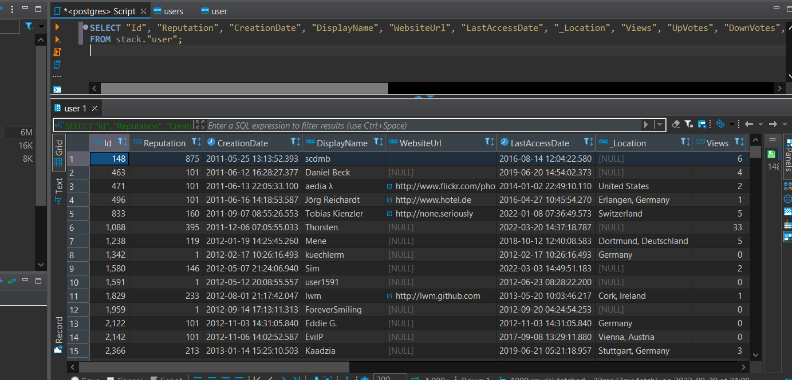

# General

Also have done some EDA and the whole analysis in Jupyter noter book its available as Outfitter_pyspark.ipynb

If the jupyter note book has to be run locally the spark jar file in the main folder has to be coppied to the jar forder where the apache spark folder is ther so that we can read the xml data


Before starting container download the data to be processed as those are large files we may directly download or just run the downloadData.py
before that make sure we have the libraries urllib to download the 7z file , pyunpack to extract the file from the 7z file
```sh
python downloadData.py
```
file to be downladed and extracted at location which is ./data/GermanStackExchange/  if data is already downloaded one can copy into that location since that location will be mounted with docker containers

A simple spark standalone cluster  A *docker-compose up* away 
The Docker compose will create the following containers:

container|Exposed ports
---|---
spark-master_spark_test-Container|9090 7077
spark_test_spark-worker-a_1|9091
spark_test_spark-worker-b_1|9092
spark_test_postgres_1|5432

# Installation

The following steps will make you run your spark cluster's containers.

## Pre requisites

* Docker installed

* Docker compose  installed


## Build

The final step to create your test cluster will be to run the compose file:

```sh
docker-compose up -d --build

```
Enter the master container to run the main file

```sh
docker exec -it spark-master_spark_test-Container /bin/bash
```

when in the container we can run this command to run the main file

```sh
/opt/spark/bin/spark-submit --master spark://spark-master:7077 --jars /opt/spark-apps/postgresql-42.2.22.jar --driver-memory 1G --executor-memory 1G /opt/spark-apps/main.py
```

to test we have a test file we can acess this externaaly from apps also

```sh
/opt/spark/bin/spark-submit --master spark://spark-master:7077 --jars /opt/spark-apps/postgresql-42.2.22.jar --driver-memory 1G --executor-memory 1G /opt/spark-apps/test.py
```

since we have mounted 2 folders we can also check the details in docker compose

local|in the docker container
---|---
./apps|/opt/spark-apps
./data|/opt/spark-data

## Validate your cluster

Just validate your cluster accesing the spark UI on each worker & master URL.

Spark Master - http://localhost:9090/

Spark Worker 1 - http://localhost:9091/

Spark Worker 2 - http://localhost:9092/

to acess the db we can use various sql querry tools for the conection check the postgre details in dockercompose yml file

finaly after the whole process runs we can see in our db 



## Some more points on the repo

* In the app folder main.py is the spark job that we submit for the whole data transformation and than push in to the postgre db
* The credentials for postgredb is the properties file in ./data
* Other than that in docker compose yaml file we can see the creds

* There are 2 dockerfile one in the main folder another inside the post gre folder

* The one in main folder is used to build the image of spark container we start with a pre decided image which has java installed

* The docker file in posgre folder is used to build the image of postgre with a seed sql file so that we have an empty users table created as stack.user

*  Also in app/main.py instead of broadcast join we have configured the spark for sort merge join  since the id collumn is easily sortable and both joining tables are large so broadcast join is avoided


